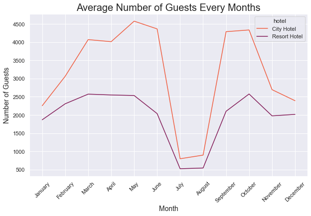
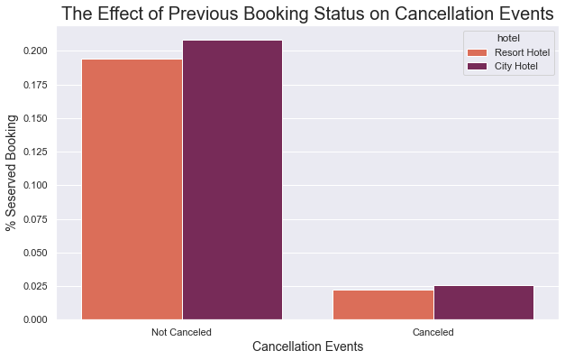
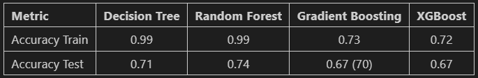

# The Comparison of Decision Tree and Ensemble Learning for Hotel Booking Cancellation Prediction
## Introduction
Human mobility in this modern era has occurred on a wide range and scale. Today, people travel a lot from short distances to very long distances. Not infrequently they also stop at several locations and stay for a certain period of time. Surely those who travel and choose to stay a while need a place to stay. On that basis, there are many services that provide temporary housing or accommodation for people who are traveling and are far from their original place of residence. People usually stay in locations close to their destination. Therefore, the types of accommodation provided are also very diverse. Lodging can also be identified based on the location and condition of the inn. Hotels are one type of lodging that is widely used by people from all over the world. Usually, hotels are located in the center of human activity, be it in big cities, or near locations that have the attraction to be visited by many people. In addition, there are also types of lodging in the form of resorts. In general, actually, the resort does not have too much difference when viewed from the shape of the building. Usually, people distinguish a regular hotel from a rating based on the location and special facilities provided. Sorting is usually always associated with tourist locations with natural nuances such as mountains, beaches, highlands, and lakes, and usually, there are special supporting facilities such as special support facilities for tourism activities with related tourist sites. While hotels in general, are often found in cities where economic and government activities are carried out.

Before people use lodging services, they are required to book a room in order to make a reservation to ensure the availability of the room to be used. Currently, the forms and methods of reservation are very diverse, especially coupled with very rapid technological developments. Today, people who are just planning a trip can already make sure they have a place to stay before they even leave their homes. Of course, this form of the reservation is also applied to several requirements that must be met. Usually, the conditions that must be met are the submission of the identity of the customer and an advance that must be paid in advance to avoid fraudulent orders. Even if certain requirements have been met, there are often many unforeseen conditions that cause a reservation to be forced to be canceled.

The data used this time is accommodation reservation data in Portugal. There are two types of lodging, namely city hotels, and resorts. There is reservation data for inn guests with reservations between July 1, 2015, to August 31, 2017. There are 31 information available such as average daily rates, number of adult guests, travel agents who make bookings, date of arrival (check-in), month of arrival, week of arrival, year of arrival, type of room booked, code of room type booked, number of babies brought by guests, information regarding changes to reservations, number of children brought by guests, information on individuals or companies responsible for reservations made carried out, information on the region of ​​origin of the guest, the type of guest, information regarding the waiting list, information regarding deposits or advances, channel distributors, information on whether the visitor is a guest who has stayed or not, the distance between the day of booking and the day of arrival, market segment, facilities available meal plans, number of bookings that were not canceled prior to the current order, number of guests bookings canceled prior to the current booking, car park space reserved by guests, number of weekend nights (Saturday or Sunday) guests stayed, number of working days (Monday to Friday) guests stayed, number of special requests made by guests (e.g. beds twins or upper floors), reservation status, date when reservation status was assigned, as well as cancellation status of reservations made by guests.
## Objective
1. Perform cancellation prediction using decision tree machine learning model.
2. Perform cancellation prediction using ensemble machine learning model.
3. Compare the predicted results of machine learning models.
4. Perform model improvement for machine learning models with the best performance.
## Exploratory Analysis

## Model Summary and Conclusion

The cancellation prediction process compares several tree-based classification models and ensemble learning. The models include decision trees, random forests, gradient boosting, and XGBoost. Based on the modeling results, the decision tree and random forest are the models with the worst performance. Although the trained model has high accuracy, the test model has very low accuracy. Overfitting on these two models occurs. Then the other two models which are sequential ensemble learning based, namely gradient boosting and XGBoost have better performance. Although the accuracy of the model is low, there is no overfitting. The difference between the two is not that significant, but the gradient boosting is slightly better. Then, the improved model is carried out using random search hyperparameter tuning to the gradient boosting model. The results are pretty good. The accuracy of the testing model has increased.